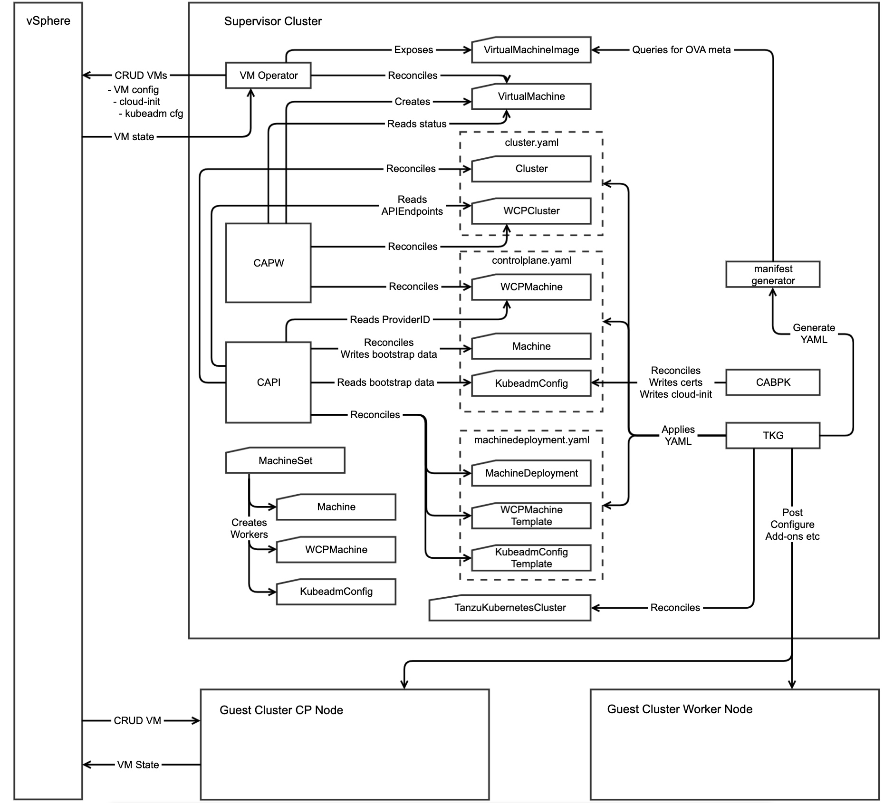

# The Basics

This document covers the fundamental concepts, controllers and objects that underpin cluster creation in Tanzu Kubernetes Grid (TKG) Service.

The User Documentation on how to provision a TanzuKubernetesCluster is [here](https://docs.vmware.com/en/VMware-vSphere/7.0/vmware-vsphere-with-kubernetes/GUID-0C2A88B3-6CB8-4495-B707-43710B94C7F6.html)

A quick glossary before we start:
- **TKG Service** is a feature of vSphere with Kubernetes that stands up virtualized "Guest Clusters" using ClusterAPI
- **Guest Cluster** is an upstream virtualized Kubernetes Cluster that is created and managed declaratively using a TKC
- **Supervisor Cluster** refers to the Kubernetes API built into vSphere that uses ESXi hosts as nodes
- **Project Pacific** is the codename of the Project that was launched as vSphere 7.0 with Kubernetes
- **WCP** stands for Workload Control Plane and was the internal name for the project before Pacific

Please note that examples were correct at the time of publishing (April 2020)

The TKG Service capability is heavily based around the Kubernetes [ClusterAPI](https://github.com/kubernetes-sigs/cluster-api) project, which is designed to allow you to declaratively define a K8S cluster in the same way as you would a Pod or Deployment. Of course this presents something of a chicken and egg problem - to stand up your K8S cluster, you need a K8S cluster to bootstrap it from. In Project Pacific, the built-in K8S cluster called the Supervisor Cluster serves this purpose.

As such, if you want to troubleshoot TKG Service Lifecycle issues, you'll spend most of the time actually interacting with the Supervisor. We'll touch on aspects of the Guest Cluster itself when we look at node debugging, security etc.

## The 3 Layer Cake
At its most basic, cluster lifecycle is managed by 3 layers: **The Guest Cluster Manager (GCM)** layer, the **ClusterAPI (CAPI)** layer and the **VM Operator** layer.


**ClusterAPI** as the middle tier is the foundation around which everything else functions. The **VM Operator** layer supplies the plumbing and the **GCM layer** provides decoration and specialization. Spec is reconciled down the layers and Status is published back up the layers.

The user starts by creating a **TanzuKubernetesCluster** (TKC) definition, which is reconciled by the GCM controller. GCM takes that TKC and turns it into CAPI / CAPW objects (CAPW is the ClusterAPI provider for Project Pacific). It also reads CAPI / CAPW status and reflects that back in TKC

The ClusterAPI layer is made up of 3 controllers and we'll look in more detail at what they do below. Fundamentally it's responsible for creating **VirtualMachine** definitions which contain the necessary configuration to stand up a cluster. Just like GCM, it also monitors the status of the VirtualMachine objects and reflects that back in the CAPI / CAPW objects.

The VM Operator layer is the declarative interface to vSphere. It creates objects such as **VirtualMachineImage** that show what images are available and reconciles VirtualMachine objects into actual VMs. It monitors the status of the real vSphere infrastructure and ensures that is reflected into the objects it manages.

## The Detailed View

As with everything, the reality is much more involved, although it follows the basic principle laid out above.



### GCM Layer

As you can see at the bottom of this diagram, the TanzuKubernetesCluster is reconciled by the GCM controller.

_Note that each controller typically has 3 instances running with leader election enabled, so when we say "the controller" for any of these, we mean whichever one of 3 controller that is currently acting as leader._

#### CAPI / CAPW object generation

GCM has to generate all of the input for the Cluster API layer. This is currently logically grouped as 3 YAML files.

- **Cluster.yaml** contains the definition of the Cluster itself. Note that it's split into two objects - the CAPI Cluster and the WCPCluster that augments it.
- **Controlplane.yaml** contains the definition of the cluster control plane components. This consists of the following:
  - A CAPI Machine. This is the baseline definition of a control plane node, containing spec and status common to all implementations
  - A WCPMachine. This is the specialization of a control plane node from the vSphere standpoint. This is where vSphere value add and status for a node can be defined.
  - A KubeadmConfig. We use kubeadm to stand up the cluster. KubeadmConfig provides the means to define in abstract terms what we want from kubeadm.
  - Note that the Control Plane will have one of each of these objects for each control plane node
- **MachineDeployment.yaml** contains the definition of the worker components. This uses a distinct approach from the control plane.
  - A MachineDeployment is a Kubernetes Deployment object that references a MachineSet. 
    - The MachineSet attempts to maintain a configured set of replica Machine and WCPMachines that it stamps out from templates
  - WCPMachineTemplate is the template for each worker WCPMachine. This is what MachineSet uses as its template for creating WCPMachines
  - KubeadmConfigTemplate is the template from which KubeadmConfig instances are created. One per node.

_Viewing these objects:_

The raw YAML that's created only actually exists in memory in the controllers. It is never persisted to disk, so the only way to examine the objects it contains is via kubectl:

Use a kubectl client authenticated with the Supervisor cluster

<p>
<details>
<summary>This example shows a cluster with 3 control plane nodes and 3 worker nodes</summary>
<pre><code>

```
$ kubectl get clusters,wcpclusters,machines,wcpmachines,kubeadmconfigs,machinedeployments,machinesets,wcpmachinetemplates,kubeadmconfigtemplates -A
 
NAMESPACE   NAME                                    PHASE
ben-test    cluster.cluster.x-k8s.io/test-cluster   provisioned
 
NAMESPACE   NAME                                                        AGE
ben-test    wcpcluster.infrastructure.cluster.vmware.com/test-cluster   6h49m
 
NAMESPACE   NAME                                                                   PROVIDERID                                       PHASE
ben-test    machine.cluster.x-k8s.io/test-cluster-control-plane-jwsx7              vsphere://423697d9-706c-3e92-7514-088978955321   running
ben-test    machine.cluster.x-k8s.io/test-cluster-control-plane-zbmm5              vsphere://4236b40f-b40e-48d6-aa12-0d6b9fe0b5fe   running
ben-test    machine.cluster.x-k8s.io/test-cluster-control-plane-zdxfr              vsphere://4236b734-7e37-33d6-5e26-066d3553d419   running
ben-test    machine.cluster.x-k8s.io/test-cluster-workers-z7j8q-6957cdb9bb-7666j   vsphere://4236cfc4-29f8-78a3-7fc4-8e1c9ccc4e61   running
ben-test    machine.cluster.x-k8s.io/test-cluster-workers-z7j8q-6957cdb9bb-kd4mw   vsphere://4236494b-a76b-9e1d-d044-4dfe42a51d3a   running
ben-test    machine.cluster.x-k8s.io/test-cluster-workers-z7j8q-6957cdb9bb-vj2jm   vsphere://42369d95-baa6-eb91-c570-4818c0157e64   running
 
NAMESPACE   NAME                                                                            PROVIDERID                                       IPADDR
ben-test    wcpmachine.infrastructure.cluster.vmware.com/test-cluster-control-plane-jwsx7   vsphere://423697d9-706c-3e92-7514-088978955321   172.26.1.18
ben-test    wcpmachine.infrastructure.cluster.vmware.com/test-cluster-control-plane-zbmm5   vsphere://4236b40f-b40e-48d6-aa12-0d6b9fe0b5fe   172.26.1.21
ben-test    wcpmachine.infrastructure.cluster.vmware.com/test-cluster-control-plane-zdxfr   vsphere://4236b734-7e37-33d6-5e26-066d3553d419   172.26.1.19
ben-test    wcpmachine.infrastructure.cluster.vmware.com/test-cluster-workers-hktqw-h97cn   vsphere://4236cfc4-29f8-78a3-7fc4-8e1c9ccc4e61   172.26.1.20
ben-test    wcpmachine.infrastructure.cluster.vmware.com/test-cluster-workers-hktqw-tkwrw   vsphere://4236494b-a76b-9e1d-d044-4dfe42a51d3a   172.26.1.23
ben-test    wcpmachine.infrastructure.cluster.vmware.com/test-cluster-workers-hktqw-v6wss   vsphere://42369d95-baa6-eb91-c570-4818c0157e64   172.26.1.22
 
NAMESPACE   NAME                                                                        AGE
ben-test    kubeadmconfig.bootstrap.cluster.x-k8s.io/test-cluster-control-plane-jwsx7   6h49m
ben-test    kubeadmconfig.bootstrap.cluster.x-k8s.io/test-cluster-control-plane-zbmm5   6h49m
ben-test    kubeadmconfig.bootstrap.cluster.x-k8s.io/test-cluster-control-plane-zdxfr   6h49m
ben-test    kubeadmconfig.bootstrap.cluster.x-k8s.io/test-cluster-workers-mg88z-99jsn   6h49m
ben-test    kubeadmconfig.bootstrap.cluster.x-k8s.io/test-cluster-workers-mg88z-9mccr   6h49m
ben-test    kubeadmconfig.bootstrap.cluster.x-k8s.io/test-cluster-workers-mg88z-g7vph   6h49m
 
NAMESPACE   NAME                                                            AGE
ben-test    machinedeployment.cluster.x-k8s.io/test-cluster-workers-z7j8q   6h49m
 
NAMESPACE   NAME                                                                AGE
ben-test    machineset.cluster.x-k8s.io/test-cluster-workers-z7j8q-6957cdb9bb   6h49m
 
NAMESPACE   NAME                                                                              AGE
ben-test    wcpmachinetemplate.infrastructure.cluster.vmware.com/test-cluster-workers-hktqw   6h49m
 
NAMESPACE   NAME                                                                          AGE
ben-test    kubeadmconfigtemplate.bootstrap.cluster.x-k8s.io/test-cluster-workers-mg88z   6h49m
```
</code></pre>
</details>
</p>

#### TanzuKubernetesCluster

The TanzuKubernetesCluster (TKC) is both the Specification for the cluster and shows detailed Status of how the cluster lifecycle is progressing. We will look in more detail at TKC in another document.

### CAPI / CAPW Layer

In abstract terms, the objects generated above provide a blueprint for the CAPI / CAPW layer to stand up the Kubernetes Cluster. The interaction of the three controllers (CAPI, CAPW and CABPK) is a little involved, but the diagram above illustrates it well.

#### CAPBK Controller

The CAPBK controller is the simplest, so this is a good place to start. Its job is to reconcile each KubeadmConfig object and apply it to some kind of node configuration protocol. In this particular instance, our configuration protocol is [cloud-init](https://cloud-init.io/), which is a universal means of configuring VMs. So the CAPBK controller's job is to create cloud-init config for each node. 

<p>
<details>
<summary>It writes this config in base64 encoded format into the Status of each KubeadmConfig object</summary>
<pre><code>

```
$ kubectl describe kubeadmconfig.bootstrap.cluster.x-k8s.io/test-cluster-control-plane-jwsx7
 
Name:         test-cluster-control-plane-jwsx7
Namespace:    ben-test
Labels:       cluster.x-k8s.io/cluster-name=test-cluster
              cluster.x-k8s.io/control-plane=true
Annotations:  <none>
API Version:  bootstrap.cluster.x-k8s.io/v1alpha2
Kind:         KubeadmConfig
Metadata:
...
Spec:
  Cluster Configuration:
    API Server:
...
    Extra Volumes:
...
    Certificates Dir:        /etc/kubernetes/pki
    Cluster Name:            test-cluster
    Control Plane Endpoint:  {{ ds.meta_data.controlPlaneEndpoint }}{{ ds.meta_data.local_ipv4 }}:6443
    Controller Manager:
...
    Dns:
...
    Etcd:
...
    Image Repository:      vmware.io
    Kubernetes Version:    1.17.4+vmware.1
    Networking:
...
    Scheduler:
...
  Files:
...
  Init Configuration:
...
  Post Kubeadm Commands:
...
  Pre Kubeadm Commands:
...
  Users:
...
Status:
  Bootstrap Data:  IyMgdGVtcGxhdGU6IGppbmphCiNjbG91ZC1jb25maWcKCndya

$ cat <boostrap-data> | base64 --decode

##template: jinja
#cloud-config
 
write_files:
-   path: /etc/kubernetes/pki/ca.crt
    owner: root:root
    permissions: '0640'
    content: |
      -----BEGIN CERTIFICATE-----
      MIICyzCCAbOgAwIBAgIBADANBgkqhkiG9w0BAQsFADAVMRMwEQYDVQQDEwprdWJl
...
```
</code></pre>
</details>
</p>

A few things to note here:

- As you can see from the above, the config provided to KubeadmConfig is extensive, as is the cloud-init configuration.
- Note the presence of certificates in the cloud-init data. As the diagram shows, these are also written out by the CABPK controller
- Finally, note the use of jinja templating. This is done so that some parameters of the cloud-init script (such as IP address) can be late-bound on the node instance itself.

Once we look at node debugging, you'll see this exact same cloud-init config being processed by the various initialization stages on the node.

#### CAPI Controller

The CAPI controller is a little like the conductor of an orchestra. It reconciles everything except for the WCP-specific objects and it tries to ensure that each object has what it needs. It also monitors the health of the various components, ensuring that the results are reflected in the Machine and Cluster status.

Note that TKG Service currently uses version [v1alpha2](https://github.com/kubernetes-sigs/cluster-api/tree/release-0.2) of ClusterAPI

In order to better understand what CAPI controller does, let's have a look at an example of a Cluster and a Machine object:

```
$ kubectl describe cluster test-cluster
 
Name:         test-cluster
Namespace:    ben-test
Labels:       <none>
Annotations:  <none>
API Version:  cluster.x-k8s.io/v1alpha2
Kind:         Cluster
Metadata:
  Creation Timestamp:  2020-04-16T17:06:53Z
  Finalizers:
    cluster.cluster.x-k8s.io
  Generation:  1
  Owner References:
    API Version:           run.tanzu.vmware.com/v1alpha1
    Block Owner Deletion:  true
    Controller:            true
    Kind:                  TanzuKubernetesCluster
    Name:                  test-cluster
    UID:                   5e434bbe-7b24-4fbd-81c0-aecc72326002
  Resource Version:        436870
  Self Link:               /apis/cluster.x-k8s.io/v1alpha2/namespaces/ben-test/clusters/test-cluster
  UID:                     e644bb12-2a08-4d27-be7f-88e460041d2d
Spec:
  Cluster Network:
    Pods:
      Cidr Blocks:
        192.0.2.0/16
    Service Domain:  tanzukubernetescluster.local
    Services:
      Cidr Blocks:
        198.51.100.0/12
  Infrastructure Ref:
    API Version:  infrastructure.cluster.vmware.com/v1alpha2
    Kind:         WCPCluster
    Name:         test-cluster
    Namespace:    ben-test
Status:
  API Endpoints:
    Host:                     192.168.123.3
    Port:                     6443
  Control Plane Initialized:  true
  Infrastructure Ready:       true
  Phase:                      provisioned
Events:                       <none>
</code></pre>
</details>
</p>
```

There are few interesting things worth calling out here:

- Note the finalizer - `cluster.cluster.x-k8s.io`. This will prevent the Cluster from being deleted until it's explicitly removed. It's how ClusterAPI ensures that things get deleted in a sane order
- Note the owner reference to TanzuKubernetesCluster `test-cluster`. All the objects are in a dependency graph of owner references. These service two important purposes:
  - They make it easy to define queries in controller-runtime like, "reconcile this object if any of its children change". That only works for the object's immediate descendents
  - They also ensure that deletion cascades down through the owner reference hierarchy. If TKC is deleted, all of its children are also deleted
- You'll see this is where the Cluster Network settings are specified
- The infrastructure reference to the WCPCluster is how the two are connected. WCPCluster also has an owner reference back to the Cluster
- APIEndpoints is typically just one value - the IP address for connecting to the API Server. It can in theory be multiple values, but only if there isn't a load balancer
- The rest of the status is just to indicate where the Cluster is in terms of its progress. That is all summarized in TKC by GCM controller.

Now let's look at a Machine:

```
$ kubectl describe machine test-cluster-control-plane-jwsx7
 
Name:         test-cluster-control-plane-jwsx7
Namespace:    ben-test
Labels:       cluster.x-k8s.io/cluster-name=test-cluster
              cluster.x-k8s.io/control-plane=true
              run.tanzu.vmware.com/control-plane-init=true
Annotations:  <none>
API Version:  cluster.x-k8s.io/v1alpha2
Kind:         Machine
Metadata:
  Creation Timestamp:  2020-04-16T17:06:53Z
  Finalizers:
    machine.cluster.x-k8s.io
  Generation:  3
  Owner References:
    API Version:           run.tanzu.vmware.com/v1alpha1
    Block Owner Deletion:  true
    Controller:            true
    Kind:                  TanzuKubernetesCluster
    Name:                  test-cluster
    UID:                   5e434bbe-7b24-4fbd-81c0-aecc72326002
    API Version:           cluster.x-k8s.io/v1alpha2
    Kind:                  Cluster
    Name:                  test-cluster
    UID:                   e644bb12-2a08-4d27-be7f-88e460041d2d
  Resource Version:        436867
  Self Link:               /apis/cluster.x-k8s.io/v1alpha2/namespaces/ben-test/machines/test-cluster-control-plane-jwsx7
  UID:                     c0666054-570b-467f-8a20-b719d267276b
Spec:
  Bootstrap:
    Config Ref:
      API Version:  bootstrap.cluster.x-k8s.io/v1alpha2
      Kind:         KubeadmConfig
      Name:         test-cluster-control-plane-jwsx7
      Namespace:    ben-test
    Data:           IyMgdGVtcGxhdGU6IGppbmphCiNjbG91ZC1jb25maWcKCndyaXRlX2ZpbGVzOgotICAgcGF0aDogL2V0Yy9rd...
...
  Infrastructure Ref:
    API Version:  infrastructure.cluster.vmware.com/v1alpha2
    Kind:         WCPMachine
    Name:         test-cluster-control-plane-jwsx7
    Namespace:    ben-test
  Metadata:
  Provider ID:  vsphere://423697d9-706c-3e92-7514-088978955321
  Version:      1.17.4+vmware.1
Status:
  Bootstrap Ready:       true
  Infrastructure Ready:  true
  Node Ref:
    Name:  test-cluster-control-plane-jwsx7
    UID:   9f03b370-bb53-4fdd-abcb-0a894a885be0
  Phase:   running
Events:    <none>
```
As you might expect, the Machine `Spec` defines the blueprint for a node and the `Status` is the current status of the node

- Note the labels. They're all quite self-explanatory, but they're all meaningful for CAPI and should not be changed
- The Machine has a finalizer just like Cluster to prevent it being deleted until the CAPI controller allows it
- Note that this Machine has two owner references - one to the TKC and one to the Cluster object. The first is created by GCM and the latter is created by CAPI.
- The Bootstrap Data is a copy of the base64-encoded cloud-init kubeadm config from KubeadmConfig Status
- Infrastructure reference is a reference to the corresponding WCPMachine for this Machine. The WCPMachine has an owner reference back to the Machine
- The ProviderID is the biosUUID of the VM
- The Version is the version of K8S that the node will run
- The Status is fairly self-explanatory
  - Bootstrap and Infrastructure Ready is a measure of whether the Bootstrap Data has been populated and whether the WCPMachine is available, respectively
  - The Node Ref is data gathered from the API server of the new cluster
Phase is `running` once the control plane node has successfully initialized. Valid options are `pending, running, terminating or failed`.

#### CAPW Controller

While the CAPI and CABPK controllers are all upstream shared code, the CAPW controller is unique to TKG Service. It's a relatively small controller that delegates all of the heavy lifting to VM Operator.

The primary purpose of CAPW is to reconcile Cluster, WCPCluster, Machine and WCPMachine objects and maintain VirtualMachine objects as a way of driving VM Operator.

An important subcomponent of CAPW is the **VirtualNetwork** which is a handshake between CAPW and the network provider, in this case NSX. See:

```
$ kubectl describe VirtualNetworks -A

Name:         test-cluster-vnet
Namespace:    ben-test
Labels:       <none>
Annotations:  ncp/extpoolid: domain-c9:b7acdc46-de1f-4613-b3ea-2dd2e52855cc-ippool-192-168-124-1-192-168-124-254
              ncp/snat_ip: 192.168.124.16
              ncp/subnet-0: 172.26.1.16/28
API Version:  vmware.com/v1alpha1
Kind:         VirtualNetwork
Metadata:
  Creation Timestamp:  2020-04-16T17:06:53Z
  Generation:          2
  Owner References:
    API Version:     infrastructure.cluster.vmware.com/v1alpha2
    Kind:            WCPCluster
    Name:            test-cluster
    UID:             9642d4c8-a024-4f6e-ac08-492c9848b19b
  Resource Version:  433547
  Self Link:         /apis/vmware.com/v1alpha1/namespaces/ben-test/virtualnetworks/test-cluster-vnet
  UID:               0c909654-a822-4831-b6dd-3cb10e25631a
Spec:
Status:
  Conditions:
    Status:        True
    Type:          Ready
  Default SNATIP:  192.168.124.16
Events:
  Type    Reason                        Age   From                                                 Message
  ----    ------                        ----  ----                                                 -------
  Normal  SuccessfulRealizeNSXResource  15m   nsx-container-ncp, 42367cfa2d665d57f3fd28b1131a3374  Successfully realized NSX resource for VirtualNetwork
```

The VirtualNetwork object is created by CAPW and populated by the NSX control plane. CAPW then copies a reference to the VirtualNetwork into the VirtualMachine when it's created.

Let's have a look at WCPCluster and WCPMachine

```
$ kubectl describe WCPCluster test-cluster
 
Name:         test-cluster
Namespace:    ben-test
Labels:       <none>
Annotations:  <none>
API Version:  infrastructure.cluster.vmware.com/v1alpha2
Kind:         WCPCluster
Metadata:
  Creation Timestamp:  2020-04-16T17:06:53Z
  Finalizers:
    wcpcluster.infrastructure.cluster.vmware.com
  Generation:  1
  Owner References:
    API Version:           run.tanzu.vmware.com/v1alpha1
    Block Owner Deletion:  true
    Controller:            true
    Kind:                  TanzuKubernetesCluster
    Name:                  test-cluster
    UID:                   5e434bbe-7b24-4fbd-81c0-aecc72326002
    API Version:           cluster.x-k8s.io/v1alpha2
    Kind:                  Cluster
    Name:                  test-cluster
    UID:                   e644bb12-2a08-4d27-be7f-88e460041d2d
  Resource Version:        433592
  Self Link:               /apis/infrastructure.cluster.vmware.com/v1alpha2/namespaces/ben-test/wcpclusters/test-cluster
  UID:                     9642d4c8-a024-4f6e-ac08-492c9848b19b
Spec:
Status:
  API Endpoints:
    Host:                192.168.123.3
    Port:                6443
  Ready:                 true
  Resource Policy Name:  test-cluster
Events:                  <none>
```

There's nothing much of interest here. In fact, there's nothing in the Spec at all to augment WCPCluster. 

The one reference of interest here is the `ResourcePolicy` name. This is a reference to a **VirtualMachineSetResourcePolicy**. 

Let's look at one:

```
$ kubectl describe VirtualMachineSetResourcePolicy -A
 
Name:         test-cluster
Namespace:    ben-test
Labels:       <none>
Annotations:  <none>
API Version:  vmoperator.vmware.com/v1alpha1
Kind:         VirtualMachineSetResourcePolicy
Metadata:
  Creation Timestamp:  2020-04-16T17:06:53Z
  Finalizers:
    virtualmachinesetresourcepolicy.vmoperator.vmware.com
  Generation:  1
  Owner References:
    API Version:     infrastructure.cluster.vmware.com/v1alpha2
    Kind:            WCPCluster
    Name:            test-cluster
    UID:             9642d4c8-a024-4f6e-ac08-492c9848b19b
  Resource Version:  433473
  Self Link:         /apis/vmoperator.vmware.com/v1alpha1/namespaces/ben-test/virtualmachinesetresourcepolicies/test-cluster
  UID:               b62f499f-c578-4aae-8cc3-ee21a150c624
Spec:
  Clustermodules:
    Groupname:  control-plane-group
    Groupname:  test-cluster-workers-0
  Folder:
    Name:  test-cluster
  Resourcepool:
    Limits:
      Cpu:     0
      Memory:  0
    Name:      test-cluster
    Reservations:
      Cpu:     0
      Memory:  0
Status:
  Clustermodules:
    Groupname:    control-plane-group
    Module UUID:  52f2e164-5c78-b73e-7045-11a515f617d6
    Groupname:    test-cluster-workers-0
    Module UUID:  5203b2e6-3cf5-4c86-fb0b-7324b25dac69
Events:           <none>
```

In the same way that CAPW creates VirtualMachines, it also creates this VirtualMachineSetResourcePolicy object which then gets populated by VM Operator. `Clustermodules` maps directly to vSphere Cluster Modules.

The WCPMachine is as you might expect:

```
$ kubectl describe WCPMachine test-cluster-control-plane-jwsx7
 
Name:         test-cluster-control-plane-jwsx7
Namespace:    ben-test
Labels:       cluster.x-k8s.io/cluster-name=test-cluster
              cluster.x-k8s.io/control-plane=true
Annotations:  <none>
API Version:  infrastructure.cluster.vmware.com/v1alpha2
Kind:         WCPMachine
Metadata:
  Creation Timestamp:  2020-04-16T17:06:53Z
  Finalizers:
    wcpmachine.infrastructure.cluster.vmware.com
  Generate Name:  test-cluster-control-plane-
  Generation:     2
  Owner References:
    API Version:           run.tanzu.vmware.com/v1alpha1
    Block Owner Deletion:  true
    Controller:            true
    Kind:                  TanzuKubernetesCluster
    Name:                  test-cluster
    UID:                   5e434bbe-7b24-4fbd-81c0-aecc72326002
    API Version:           cluster.x-k8s.io/v1alpha2
    Kind:                  Machine
    Name:                  test-cluster-control-plane-jwsx7
    UID:                   c0666054-570b-467f-8a20-b719d267276b
  Resource Version:        435441
  Self Link:               /apis/infrastructure.cluster.vmware.com/v1alpha2/namespaces/ben-test/wcpmachines/test-cluster-control-plane-jwsx7
  UID:                     7902645a-5ee6-4488-9691-7502bb90238a
Spec:
  Class Name:     best-effort-small
  Image Name:     photon-3-k8s-v1.17.4---vmware.1-tkg.1.0dba899
  Provider ID:    vsphere://423697d9-706c-3e92-7514-088978955321
  Storage Class:  gc-storage-profile
Status:
  Ready:     true
  Vm ID:     423697d9-706c-3e92-7514-088978955321
  Vm Ip:     172.26.1.18
  Vmstatus:  ready
Events:      <none>
```

Only thing worth noting is the Provider ID, which as you can see is the VM biosUUID. A unique infrastructure ID is part of the integration with CAPI and that's why it's part of the `Spec` and not the `Status`.

#### Notes About Worker Machines

As you'll see from the diagram, worker machines are generated by a **MachineSet** rather than being explicitly defined when the cluster YAML is applied. This is so that the workers can be scaled up (and in theory, down - although we don't currently support that).

The owner ref hierarchy of worker machines is a little different.

- The Machine has an owner ref to its MachineSet. In contrast, a control plane Machine has a reference to the Cluster and the TKC
- The WCPMachine has an owner ref to both the MachineSet and the Machine it corresponds to. In contrast, a control plane WCPMachine refers to its associated Machine and the TKC

A final difference worth noting is that the name of a worker WCPMachine does not match the name of its Machine. This is because they receive generated names independently. This is in contrast to control plane Machines and WCPMachines which have the same name

### VM Operator Layer

VM Operator provides a declarative means of manipulating vSphere infrastructure - primarily VirtualMachines. The VM Operator API is now in GitHub at http://github.com/vmware-tanzu/vm-operator-api

#### VirtualMachine

The main Kubernetes object of interest in the VM Operator layer is, of course, **VirtualMachine**. 

Let's look at one:

```
$ kubectl describe virtualmachine test-cluster-control-plane-jwsx7
 
Name:         test-cluster-control-plane-jwsx7
Namespace:    ben-test
Labels:       capw.vmware.com/cluster.name=test-cluster
              capw.vmware.com/cluster.role=controlplane
Annotations:  vsphere-cluster-module-group: control-plane-group
              vsphere-tag: CtrlVmVmAATag
API Version:  vmoperator.vmware.com/v1alpha1
Kind:         VirtualMachine
Metadata:
  Creation Timestamp:  2020-04-16T17:07:10Z
  Finalizers:
    virtualmachine.vmoperator.vmware.com
  Generation:  1
  Owner References:
    API Version:           infrastructure.cluster.vmware.com/v1alpha2
    Block Owner Deletion:  true
    Controller:            true
    Kind:                  WCPMachine
    Name:                  test-cluster-control-plane-jwsx7
    UID:                   7902645a-5ee6-4488-9691-7502bb90238a
  Resource Version:        442007
  Self Link:               /apis/vmoperator.vmware.com/v1alpha1/namespaces/ben-test/virtualmachines/test-cluster-control-plane-jwsx7
  UID:                     dff16c1e-8306-4cad-b911-2f9aa2ffcce5
Spec:
  Class Name:  best-effort-small
  Image Name:  photon-3-k8s-v1.17.4---vmware.1-tkg.1.0dba899
  Network Interfaces:
    Network Name:  test-cluster-vnet
    Network Type:  nsx-t
  Power State:     poweredOn
  Readiness Probe:
    Tcp Socket:
      Port:              6443
  Resource Policy Name:  test-cluster
  Storage Class:         gc-storage-profile
  Vm Metadata:
    Config Map Name:  test-cluster-control-plane-jwsx7-cloud-init
    Transport:        ExtraConfig
Status:
  Bios UUID:    423697d9-706c-3e92-7514-088978955321
  Host:         10.185.22.162
  Phase:        Created
  Power State:  poweredOn
  Unique ID:    vm-1077
  Vm Ip:        172.26.1.18
Events:         <none>
```

The most interesting thing about this VirtualMachine is what's _not_ there as opposed to what _is_ there. Where is all of the cloud-init config that was in the Machine's bootstrap data? As you may have spotted, it's actually in a ConfigMap that's stored separate from the VirtualMachine. THis makes sense because it's a set of KV pairs. 

Note that the transport specified is ExtraConfig, so VM Operator uses the GuestInfo ExtraConfig to apply the cloud-init metadata.

Here is are the contents of that ConfigMap with key-value pairs that are directly applied to the VM's ExtraConfig:

```
$ kubectl describe configmap test-cluster-control-plane-jwsx7-cloud-init
 
Name:         test-cluster-control-plane-jwsx7-cloud-init
Namespace:    ben-test
Labels:       <none>
Annotations:  <none>
Data
====
guestinfo.metadata:
----
Cmluc3RhbmNlLWlkOiAidGVzdC1jbHVzdGVyLWNvbnRyb2wtcGxhbmUtandzeDciCmxvY2FsLWhvc3RuYW1lOiAidGVzdC1jbHVzdGVyLWNvbnRyb2wtcGxhbmUtandzeDciCgpjb250cm9sUGxhbmVFbmRwb2ludDogIjE5Mi4xNjguMTIzLjM6NjQ0MyIKCg==
guestinfo.metadata.encoding:
----
base64
guestinfo.userdata:
----
IyMgdGVtcGxhdGU6IGppbmphCiNjbG91ZC1jb25maWcKCndyaXRlX2ZpbGVzOgotICAgcGF0aDogL2V0...
...
guestinfo.userdata.encoding:
----
base64
Events:  <none>
```

#### VirtualMachineImage

As you may be aware, VirtualMachineImage is a mechanism VM Operator has of notifying the user what Images are available for creating VirtualMachines. Note that VM Operator is currently opinionated to a clone mechanism where a VirtualMachine is always cloned from an Image. There is currently no way of specifying ISOs or OVAs directly.

A VirtualMachineImage from a Guest Clusters standpoint is therefore a reflection of the available K8S versions that can be specified:

```
$ kubectl get VirtualMachineImages
 
NAME                                            VERSION                          OSTYPE
photon-3-k8s-v1.17.4---vmware.1-tkg.1.0dba899   v1.17.4+vmware.1-tkg.1.0dba899   vmwarePhoton64Guest
You don't need to specify the full version when you create a TKC. You can just use the short version.
```

#### VirtualMachineClass

VirtualMachineClass is a way of encapsulating a t-shirt size and associated settings for a VM. Guest Clusters comes out of the box with a variety of these VirtualMachineClasses built-in:

```
$ kubectl get VirtualMachineClasses
 
NAME                 AGE
best-effort-large    31h
best-effort-medium   31h
best-effort-small    31h
best-effort-xlarge   31h
best-effort-xsmall   31h
guaranteed-large     31h
guaranteed-medium    31h
guaranteed-small     31h
guaranteed-xlarge    31h
guaranteed-xsmall    31h
```

"Best Effort" in this context means that the memory and CPU are not reserved. A "Guaranteed" class means that the CPU and Memory are fully reserved

#### Persistent Volumes

When a persistent volume is created for a Pod in a Guest Cluster, it must be attached and mounted to the node the pod is running in. This is typically achieved via a Cloud Provider, but in Guest Clusters, it is achieved paravirtially.

A request for a PersistentVolumeClaim from a particular StorageClass a Guest Cluster has access to causes a VMDK-based PersistentVolume and PersistentVolumeClaim to be created in the Supervisor Cluster. When a pod is deployed to the Guest Cluster that uses the PVC, it needs to be associated with the VirtualMachine that represents the node. This is actually a reconfiguration of the Spec of the VirtualMachine by the CSI control plane (via CNS integration) and the attach/detach is then handled by VM Operator.

Note the Spec of the worker VirtualMachine running the pod:

```
...
Spec:
  Class Name:  best-effort-small
  Image Name:  photon-3-k8s-v1.17.4---vmware.1-tkg.1.0dba899
  Network Interfaces:
    Network Name:        test-cluster-vnet
    Network Type:        nsx-t
  Power State:           poweredOn
  Resource Policy Name:  test-cluster
  Storage Class:         gc-storage-profile
  Vm Metadata:
    Config Map Name:  test-cluster-workers-hktqw-v6wss-cloud-init
    Transport:        ExtraConfig
  Volumes:
    Name:  5e434bbe-7b24-4fbd-81c0-aecc72326002-427281a3-780b-41dd-80d4-165c7624c31d
    Persistent Volume Claim:
      Claim Name:  5e434bbe-7b24-4fbd-81c0-aecc72326002-427281a3-780b-41dd-80d4-165c7624c31d
...
```

This isn't necessarily explicitly related to lifecycle, but it's definitely interesting to note that VM configuration is all handled through the VIrtualMachine object.


<p>
<details>
<summary>Click to see example</summary>
<pre><code>
...
</code></pre>
</details>
</p>
