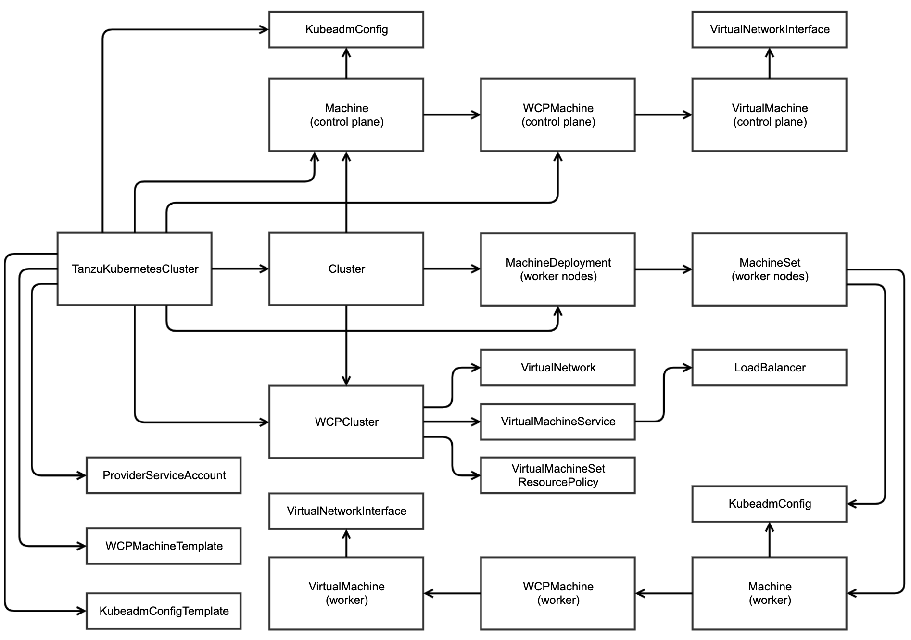

# Cluster Deletion

Before reading this section, it's worthwhile reviewing [The Basics](creation-basics.md) to establish a good grounding of the various controllers, objects and the relationship between them

## Summary

One of the real benefits to Guest Clusters is the ephemeral nature of them. Once you have a TanzuKubernetesCluster YAML that works for you, it's relatively trivial to stand one up, run something in it for a period of time and then tear it down again. 

Of course you don't have to do this, but a key design principle of Guest Clusters is that they should be cheap to create, cheap to maintain and cheap to destroy. 

Once you've run the gauntlet of [cluster creation](creation-milestones.md), cluster deletion sounds like it should be really straightforward - just blow away the cluster and all of its dependencies and start over. However, deletion and cleanup can be more complex than might initially be appreciated.

Understanding how cluster deletion works is invaluable if you find yourself in a situation where you have to troubleshoot it.

### How To Delete A Cluster

It's interesting to note that our user docs don't tell you how to delete a cluster. Maybe it seems too obvious. But it's worth addressing the ideal scenario and what you should expect to see.

At its most simple, deletion is just a reversal of creation. If we consider that creation is often as simple as:

`kubectl apply -f test-cluster.yaml`

Deletion can be as simple as:

`kubectl delete -f test-cluster.yaml` 
or 
`kubectl delete -n ben-test tkc test-cluster`

#### Delete is a Blocking Call - Give it Time!

Note that the default deletion protocol by kubectl is that it blocks until deletion is completed. Well, you might think, all I'm doing is deleting an object in an API Server (the TanzuKubernetesCluster) so who cares if it's synchronous or asynchronous - it should just complete immediately, right?

Well, actually no. The `kubectl delete` call will block until absolutely everything is gone and we designed it that way. That means that it might _appear_ that deletion has hung when in fact - it may well be busy going through the motions of tearing down the cluster.

#### Deleting a Namespace

There's nothing preventing you from deleting a namespace with Guest Clusters in it from the vSphere client. And it _should_ work. While it might seem to have the same effect - a blocking call from the vSphere client, the way it works under the covers is very different.

As we'll see below, cluster deletion is a complex dance of interdependencies, not unlike a domino run. All you have to do is topple the first domino and everything else should cascade from there. When you delete a namespace however, the Kubernetes namespace controller takes a tally of all the dominos in the run and attempts to topple them asynchronously in a non-deterministic order. The vSphere service that handles deletion then sits by polling for the namespace to have been removed.

So by all means delete a namespace with Guest Clusters in it, but by deleting the Guest Clusters before the namespace, you're taking a more deterministic and easier to triage path to successful cleanup.

#### Deletion Controls

Kubernetes Clusters are complex beasts and we've tried to put safeguards in place to help prevent inadventent problems due to accidental deletion.

As such, you cannot delete Guest Cluster nodes from the vSphere UI. You can't even power them off. All of that has to be done by manipulating the TanzuKuberenetesCluster via kubectl.

There is also a Webhook in place to prevent you from deleting or editing CAPI, CAPW, CAPBK or VirtualMachine objects in your supervisor namespace. All of those objects are read-only. The control point is the TanzuKuberenetesCluster only. This is why it's so important that deletion _works_.

### The Object Graph

This section describes the interdependencies between objects and how this impacts cluster deletion.

#### Owner References

I alluded above to a domino effect that happens when you delete a TKC. This is exactly what happens and is achieved through a Kubernetes feature called Owner References. An object can be _owned_ by another and if the owner is deleted, that deletion can cascade down to the owned object

You can see an owner reference by typing `kubectl describe <object>` and looking for a clause that looks like this:

```
  Owner References:
    API Version:           cluster.x-k8s.io/v1alpha2
    Block Owner Deletion:  true
    Controller:            true
    Kind:                  MachineSet
    Name:                  test-cluster-workers-hphzf-54569b9cb4
    UID:                   f6bd0f3d-ba58-409c-9ffe-1061d531e0ae
```
This example here is a worker CAPI Machine object that has an owner. The owner is a MachineSet and the owner reference gives enough information for any caller to be able to identify the MachineSet object. If this MachineSet were to be deleted, the CAPI Machines it owns will also be deleted.

What this means in effect is that there is a graph of owner references that cascades down from TanzuKubernetesCluster all the way down to the VirtualMachines. The graph looks roughly like this:



These object dependencies are put in place by different controllers at different times in different reconciliation loops, but it's clear that the domino analogy holds - delete TKC and the deletion propagates right through the whole graph.

#### Finalizers

Kubernetes provides a mechanism that allows a controller to block object deletion until a dependency which may not be possible to express as a Kubernetes object has been properly cleaned up. This mechanism is called a Finalizer. If you look at many of the objects described in the graph above, you'll see finalizers.

A good example of the benefit of using finalizers is in VirtualMachine. The VM operator controller doesn't allow a VirtualMachine to be deleted until it has confirmed that the real VM in vSphere has gone. This is _really_ important. Imagine if the vSphere VM deletion failed but the VirtualMachine object deletion succeeded. We'd end up with an orphaned VM that vSphere can't delete. 

Similarly the CAPI controller won't remove its finalizer on a Machine until it's confident that the node has been drained. Again, this ensures that cleanup is conducted elegantly. If a VirtualMachine is deleted before the node drain has completed, the CAPI controller could timeout trying to drain a node that no longer exists.

You can see the finalizers on an object in its `Metadata` just above `Owner References`:

```
Finalizers:
    virtualmachine.vmoperator.vmware.com
```
#### Deletion Timestamp

So how do you know if an object in Kubernetes is in the process of being deleted? The answer is simple - it has a `Deletion Timestamp`. If it does not have a `Deletion Timestamp`, it has not yet been deleted. 

Given the role of Finalizers described above, it's perfectly normal for an object to have a `Deletion Timestamp` and a `Finalizer` and for it to still be visible in the API Server. Once the Finalizer is removed, it can finally be garbage collected.

### Monitoring Deletion

The simplest way to monitor deletion is to have a `kubectl get` command that includes all of principle objects in the depdendency graph and watch them slowly get garbage collected.

An example would be:

```
$ kubectl -n ben-test get tkc,cluster,machine,wcpmachine,virtualmachine,machinedeployment,machineset,wcpmachinetemplate,kubeadmconfigtemplate,configmap,secret,vnet

NAME                                                       CONTROL PLANE   WORKER   DISTRIBUTION                     AGE   PHASE
tanzukubernetescluster.run.tanzu.vmware.com/test-cluster   3               1        v1.16.8+vmware.1-tkg.3.60d2ffd   10h   running

NAME                                    PHASE
cluster.cluster.x-k8s.io/test-cluster   provisioned

NAME                                                                   PROVIDERID                                       PHASE
machine.cluster.x-k8s.io/test-cluster-control-plane-fpk68              vsphere://421bc5bf-8582-d469-1ea8-54da8e032c9b   running
machine.cluster.x-k8s.io/test-cluster-control-plane-fv7m4              vsphere://421b11b2-6b7e-8fb0-84f0-c397949a810a   running
machine.cluster.x-k8s.io/test-cluster-control-plane-lc8dk              vsphere://421b4ae5-7184-4f1a-a000-a3aefc81003a   running
machine.cluster.x-k8s.io/test-cluster-workers-hphzf-54569b9cb4-pwz9k   vsphere://421b55a2-9ac3-8712-f0e2-412a9a8cb21e   running

NAME                                                                            PROVIDERID                                       IPADDR
wcpmachine.infrastructure.cluster.vmware.com/test-cluster-control-plane-fpk68   vsphere://421bc5bf-8582-d469-1ea8-54da8e032c9b   172.26.0.228
wcpmachine.infrastructure.cluster.vmware.com/test-cluster-control-plane-fv7m4   vsphere://421b11b2-6b7e-8fb0-84f0-c397949a810a   172.26.0.226
wcpmachine.infrastructure.cluster.vmware.com/test-cluster-control-plane-lc8dk   vsphere://421b4ae5-7184-4f1a-a000-a3aefc81003a   172.26.0.229
wcpmachine.infrastructure.cluster.vmware.com/test-cluster-workers-2bflr-h9rws   vsphere://421b55a2-9ac3-8712-f0e2-412a9a8cb21e   172.26.0.227

NAME                                                                               AGE
virtualmachine.vmoperator.vmware.com/test-cluster-control-plane-fpk68              10h
virtualmachine.vmoperator.vmware.com/test-cluster-control-plane-fv7m4              10h
virtualmachine.vmoperator.vmware.com/test-cluster-control-plane-lc8dk              10h
virtualmachine.vmoperator.vmware.com/test-cluster-workers-hphzf-54569b9cb4-pwz9k   10h

NAME                                                            AGE
machinedeployment.cluster.x-k8s.io/test-cluster-workers-hphzf   10h

NAME                                                                AGE
machineset.cluster.x-k8s.io/test-cluster-workers-hphzf-54569b9cb4   10h

NAME                                                                              AGE
wcpmachinetemplate.infrastructure.cluster.vmware.com/test-cluster-workers-2bflr   10h

NAME                                                                          AGE
kubeadmconfigtemplate.bootstrap.cluster.x-k8s.io/test-cluster-workers-klqcn   10h

NAME                                                    DATA   AGE
configmap/test-cluster-control-plane-fpk68-cloud-init   4      10h
configmap/test-cluster-control-plane-fv7m4-cloud-init   4      10h
configmap/test-cluster-control-plane-lc8dk-cloud-init   4      10h
configmap/test-cluster-workers-2bflr-h9rws-cloud-init   4      10h

NAME                                    TYPE                                  DATA   AGE
secret/default-token-km2hm              kubernetes.io/service-account-token   3      10h
secret/test-cluster-ca                  Opaque                                2      10h
secret/test-cluster-ccm-token-22mdd     kubernetes.io/service-account-token   3      10h
secret/test-cluster-encryption          Opaque                                1      10h
secret/test-cluster-etcd                Opaque                                2      10h
secret/test-cluster-kubeconfig          Opaque                                1      10h
secret/test-cluster-proxy               Opaque                                2      10h
secret/test-cluster-pvcsi-token-twj78   kubernetes.io/service-account-token   3      10h
secret/test-cluster-sa                  Opaque                                2      10h
secret/test-cluster-ssh                 kubernetes.io/ssh-auth                1      10h
secret/test-cluster-ssh-password        Opaque                                1      10h

NAME                                          AGE
virtualnetwork.vmware.com/test-cluster-vnet   10h
```
